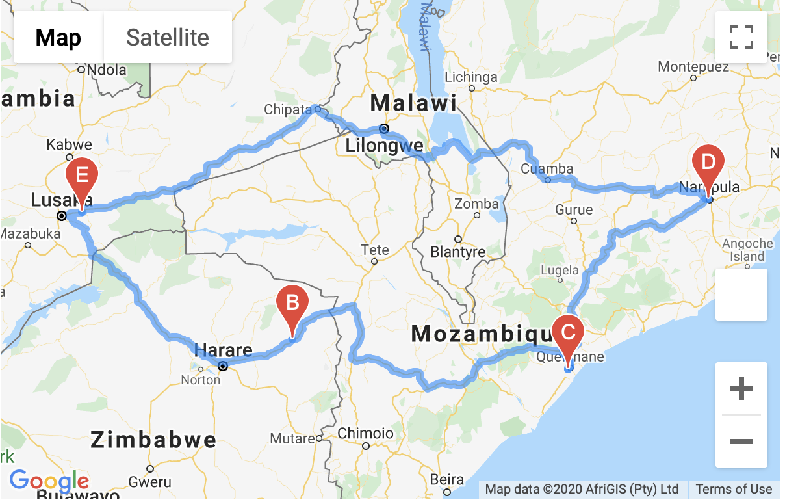

# World_Weather_Analysis
Using APIs to Visualize Weather Data
## Overview of World Weather Data Analysis
 - The purpose of this project was utilizing the Python, Pandas, and scatterplot skills that I have learned, and incorporating those skills into creating a "PlanMyTrip" app that involves the collection and analysis of weather data across cities worldwide. By retrieving, collecting, and cleaning weather data, which was retrieved by the OpenWeatherMap API to request the current weather data from each unique city for our Pandas Dataframe, I was able to plot the weather data and examine correlations with the visualizations. The API call from the OpenWeather site allowed the "PlanMyTrip" app to retrieve information for our pandas dataframe, which included a citie's geographic coordinate system, latitude and longitude, the citie's maximum temperature at the present time, the humidity level in percentage, cloudiness level, wind speed, and current weather description. The image below showcases our Weather dataframe used for identifying vacaction spots based on citie's weather conditions.

**Marker Layer Map for Cities**
  - From the Weather dataframe, a marker layer map was then able to be created. The marker layer map is a function of the Google Maps API that provided pop-ups of locations of hotels that fit a search criteria. A heat layer map was also used for the Google Maps API to support the search criteria code that used two input statements that prompted the user to enter their minimum and maximum temperature criteria for their vacation. The heat layer map provided a visual for app users to identify ideal conditions suited for their vacation preferences based not only on temperature, but also overall weather conditions. Additional code was used to create a hotel dataframe to locate nearby hotels based on the cities that fit the vacation search criterion. The image below depicts the Google API heat layer marker map that provided the cities that match the search criterion and the nearest hotel based on the search parameters.

**Marker Layer Map for Travel Itinerary**
  - Further usage of the Google Maps API resulted in the creation of a travel itinerary. By enabling the "Directions API" in the Google account and importing the previous weather, cities, and hotel dataframes, an itinerary is made by writing code that creates a starting and ending point that is the same city, and three other cities that are way points for the route. Gmaps documentation is used to the directions layer map presented below. 

