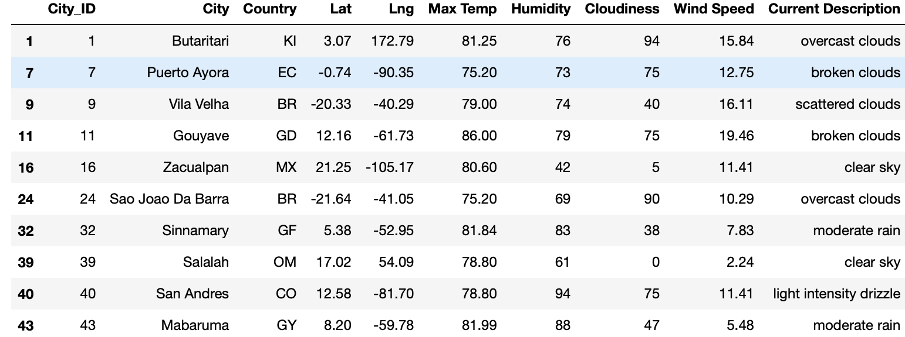
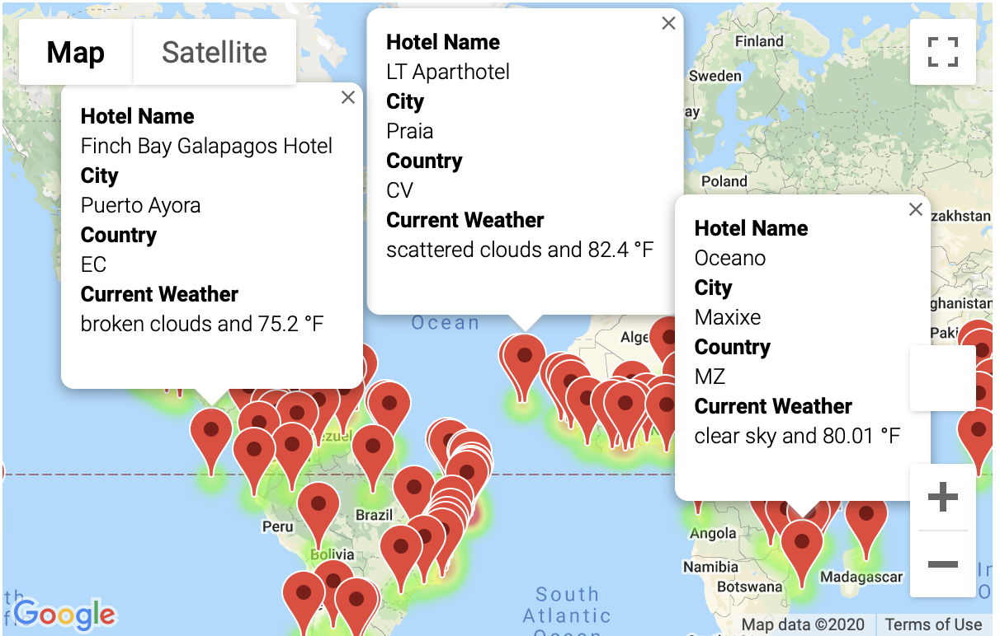

# World_Weather_Analysis
Using APIs to Visualize Weather Data
## Overview of World Weather Data Analysis
 - The purpose of this project was utilizing the Python, Pandas, and scatterplot skills that I have learned, and incorporating those skills into creating a "PlanMyTrip" app that involves the collection and analysis of weather data across cities worldwide. By retrieving, collecting, and cleaning weather data, which was retrieved by the OpenWeatherMap API to request the current weather data from each unique city for our Pandas Dataframe, I was able to plot the weather data and examine correlations with the visualizations. The API call from the OpenWeather site allowed the "PlanMyTrip" app to retrieve information for our pandas dataframe, which included a citie's geographic coordinate system, latitude and longitude, the citie's maximum temperature at the present time, the humidity level in percentage, cloudiness level, wind speed, and current weather description. The image below showcases our Weather dataframe used for identifying vacaction spots based on citie's weather conditions.

**Marker Layer Map**
  - From the Weather dataframe, a marker layer map was then able to be created. The marker layer map is a function of the Google Maps API, which allowed for a heat layer map to be created and incorporated in order to support the search criteria code that was used for hotel selection based on weather conditions. The heat layer map provided a visual for app users to identify ideal conditions suited for their vacation preferences based on temperature and overall weather conditions. The image below depicts the Google API heat layer marker maps.

